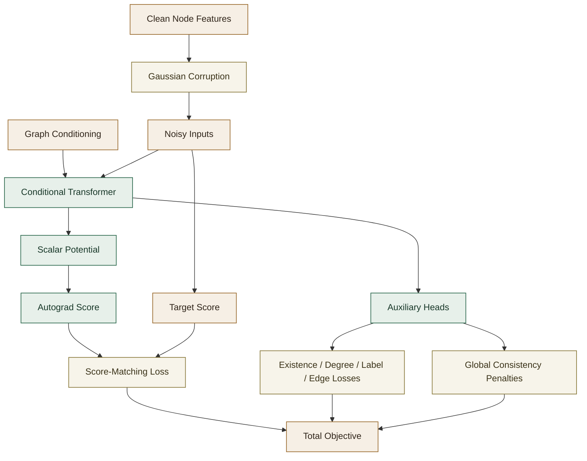

# Conditional Node Field Training and Losses

This companion document collects the operational details of the Conditional Node Field model:

- auxiliary and structural losses
- the full training objective
- sampling updates
- inference-time structural projection

The conceptual model, conditioning interface, and architecture discussion remain in
[`2_CONDITIONAL_NODE_FIELD_README.md`](2_CONDITIONAL_NODE_FIELD_README.md).

## Documentation Map

[`2_CONDITIONAL_NODE_FIELD_README.md`](2_CONDITIONAL_NODE_FIELD_README.md)

This is the conceptual reference for the Conditional Node Field model itself: energy-based interpretation, conditioning layouts, architecture, and design rationale.

[`2D_TARGET_GUIDANCE_README.md`](2D_TARGET_GUIDANCE_README.md)

This is the dedicated reference for the two supported target-guidance routes: classifier-free guidance (CFG) and separate post-hoc guidance through an auxiliary classifier or regressor.

[`2C_CONDITIONAL_NODE_FIELD_OPTIMIZATION_README.md`](2C_CONDITIONAL_NODE_FIELD_OPTIMIZATION_README.md)

This is the operational reference for hyperparameters, loss scaling, training metrics, and how to interpret the verbose epoch summaries.

[`4_MAIN_CLASS_INTERFACES_README.md`](4_MAIN_CLASS_INTERFACES_README.md)

This is the API reference for the main public classes and their parameters.

## Auxiliary And Structural Losses

The Conditional Node Field generator is not only trained to learn a conditional energy landscape. It also predicts graph-structural properties through supervised heads and soft global consistency terms.

The complete loss is easiest to understand as a sum of three groups:

1. generative score matching,
2. local supervised heads,
3. graph-level soft consistency penalties.

### 1. Conditional Node Field Score Loss

This is the main generative term:

$$
\mathcal{L}_{\mathrm{node\_field}}
$$

It teaches the model’s score field to match the denoising score implied by Gaussian corruption.

Operationally:

- acts on every valid feature dimension of every valid node,
- is masked over padded rows,
- is always present.

This term is logged as:

- `node_field`

### 2. Node Existence Loss

The existence target is the true node-support mask:

$$
y^{\mathrm{exist}}_{b,i} \in \{0, 1\}
$$

The existence head predicts logits:

$$
\ell^{\mathrm{exist}}_{b,i}
$$

and the implementation applies binary cross-entropy with logits:

$$
\mathcal{L}_{\mathrm{exist}} = \mathrm{BCEWithLogits}(\ell^{\mathrm{exist}}, y^{\mathrm{exist}})
$$

with positive-class reweighting through `exist_pos_weight`.

Important detail:

- this loss is evaluated on all padded slots, not only valid nodes,
- real nodes act as positives,
- padded rows act as true negatives.

That means this term does two jobs:

- teaches occupancy,
- teaches the model not to materialize padded slots.

This term is logged as:

- `exist`

If all training graphs have the same node count and the existence target is constant, the implementation disables the existence head and drops this term.

### 3. Node Count Loss

This is a soft global consistency term built on top of the existence head.

The conditioning vector contains an explicit desired node count:

$$
n^{\mathrm{target}}_b
$$

The model’s existence logits imply an expected number of materialized nodes:

$$
\hat{n}_b = \sum_i \sigma(\ell^{\mathrm{exist}}_{b,i})
$$

The implementation penalizes disagreement with a scale-normalized Huber loss:

$$
\mathcal{L}_{\mathrm{node\_count}} =
\mathrm{Huber}\!\left(\frac{\hat{n}_b}{\max(n^{\mathrm{target}}_b,1)}, \frac{n^{\mathrm{target}}_b}{\max(n^{\mathrm{target}}_b,1)}\right)
$$

This makes the term behave like a relative node-count mismatch per graph instead of an absolute count error that grows with graph size.
It is useful because the per-slot BCE loss does not by itself guarantee that the total occupancy mass matches the desired graph size.

This term is logged as:

- `node_count_loss`

and weighted by:

- `lambda_node_count_importance`

### 4. Degree Classification Loss

The degree target is the true node degree clipped to the supported class range:

$$
y^{\mathrm{deg}}_{b,i} \in \{0, \dots, D_{\max}\}
$$

The degree head predicts logits:

$$
\ell^{\mathrm{deg}}_{b,i} \in \mathbb{R}^{D_{\max}+1}
$$

and the implementation applies masked cross-entropy:

$$
\mathcal{L}_{\mathrm{deg}} =
\mathrm{MaskedCrossEntropy}(\ell^{\mathrm{deg}}, y^{\mathrm{deg}})
$$

Masking means:

- only materialized nodes contribute,
- padded rows do not contribute.

This term is logged as:

- `deg_ce`

and weighted by:

- `lambda_degree_importance`

### 5. Node Label Loss

If node labels are supervised and not collapsed to a constant, the node-label head predicts categorical logits:

$$
\ell^{\mathrm{label}}_{b,i} \in \mathbb{R}^{K}
$$

for encoded node-label targets:

$$
y^{\mathrm{label}}_{b,i} \in \{0, \dots, K-1\}
$$

The loss is masked cross-entropy:

$$
\mathcal{L}_{\mathrm{label}} =
\mathrm{MaskedCrossEntropy}(\ell^{\mathrm{label}}, y^{\mathrm{label}})
$$

Only valid nodes contribute.

This term is logged as:

- `node_label_ce`

and weighted by:

- `lambda_node_label_importance`

If node labels are constant or disabled by the supervision plan, this term is absent.

### 6. Direct Edge Locality Loss

If direct edge supervision is enabled, the model scores selected node pairs with an edge MLP:

$$
\ell^{\mathrm{edge}}_{(i,j)} = f_{\mathrm{edge}}(h_i, h_j)
$$

and applies BCE with logits against direct edge-presence targets:

$$
\mathcal{L}_{\mathrm{edge}} =
\mathrm{BCEWithLogits}(\ell^{\mathrm{edge}}, y^{\mathrm{edge}})
$$

This is the main structural pairwise supervision term used by the decoder path.

This term is logged as:

- `edge_ce`

and weighted by:

- `lambda_direct_edge_importance`

### 7. Edge Count Loss

This is a soft global consistency term on the full soft adjacency field.

From the dense edge-probability matrix:

$$
P_{b,ij}
$$

the implementation forms a symmetrized expected undirected edge count:

$$
\hat{m}_b = \sum_{i < j} \frac{P_{b,ij} + P_{b,ji}}{2}
$$

restricted to currently materialized node slots.

The conditioning vector contains a desired edge count:

$$
m^{\mathrm{target}}_b
$$

and the loss is:

$$
\mathcal{L}_{\mathrm{edge\_count}} =
\mathrm{Huber}\!\left(\frac{\hat{m}_b}{\max(m^{\mathrm{target}}_b,1)}, \frac{m^{\mathrm{target}}_b}{\max(m^{\mathrm{target}}_b,1)}\right)
$$

This makes the term behave like a relative edge-count mismatch per graph instead of an absolute edge-count error.
It encourages the soft edge field to match the requested graph density before the decoder’s discrete optimization stage.

This term is logged as:

- `edge_count_loss`

and weighted by:

- `lambda_edge_count_importance`

### 8. Degree/Edge Handshake Consistency Loss

For any undirected graph, the handshake identity says:

$$
\sum_i \deg(i) = 2 |E|
$$

The implementation turns the degree logits into expected degrees:

$$
\hat{d}_{b,i} = \sum_{k=0}^{D_{\max}} k \cdot \mathrm{softmax}(\ell^{\mathrm{deg}}_{b,i})_k
$$

and forms the expected total degree:

$$
\hat{D}_b = \sum_i \hat{d}_{b,i}
$$

over materialized nodes.

It then compares that to twice the desired edge count with the same target-relative normalization:

$$
\mathcal{L}_{\mathrm{deg\_edge}} =
\mathrm{Huber}\!\left(\frac{\hat{D}_b}{\max(2 m^{\mathrm{target}}_b,1)}, \frac{2 m^{\mathrm{target}}_b}{\max(2 m^{\mathrm{target}}_b,1)}\right)
$$

This term is not a replacement for degree supervision or edge supervision. It is a soft graph-level compatibility penalty tying the degree head and the edge-count target together.

This term is logged as:

- `degree_edge_consistency_loss`

and weighted by:

- `lambda_degree_edge_consistency_importance`

### 9. Edge Label Loss

If edge labels are supervised and not collapsed to a constant, the edge-label head predicts categorical logits for supervised node pairs:

$$
\ell^{\mathrm{edge\_label}}_{(i,j)} \in \mathbb{R}^{C}
$$

and the loss is standard cross-entropy:

$$
\mathcal{L}_{\mathrm{edge\_label}} =
\mathrm{CrossEntropy}(\ell^{\mathrm{edge\_label}}, y^{\mathrm{edge\_label}})
$$

This term is logged as:

- `edge_label_ce`

and weighted by:

- `lambda_edge_label_importance`

### 10. Auxiliary Locality Loss

If higher-horizon locality supervision is enabled, the model uses a second edge MLP to predict auxiliary locality targets for node pairs that are not necessarily direct edges.

The loss is again BCE with logits:

$$
\mathcal{L}_{\mathrm{aux}} =
\mathrm{BCEWithLogits}(\ell^{\mathrm{aux}}, y^{\mathrm{aux}})
$$

This term is intended as representation regularization rather than as the primary decoder-facing edge signal.

This term is logged as:

- `aux_locality_ce`

and weighted by:

- `lambda_auxiliary_edge_importance`

## Total Training Objective

The implementation builds `total_loss` additively from whichever terms are active for the current dataset and supervision plan:

$$
\mathcal{L}_{\mathrm{total}} =
\mathcal{L}_{\mathrm{equilibrium\_matching}}
+ \lambda_{\mathrm{deg}} \mathcal{L}_{\mathrm{deg}}
+ \lambda_{\mathrm{exist}} \mathcal{L}_{\mathrm{exist}}
+ \lambda_{\mathrm{node\_count}} \mathcal{L}_{\mathrm{node\_count}}
+ \lambda_{\mathrm{node\_label}} \mathcal{L}_{\mathrm{label}}
+ \lambda_{\mathrm{edge}} \mathcal{L}_{\mathrm{edge}}
+ \lambda_{\mathrm{edge\_count}} \mathcal{L}_{\mathrm{edge\_count}}
+ \lambda_{\mathrm{deg\_edge}} \mathcal{L}_{\mathrm{deg\_edge}}
+ \lambda_{\mathrm{edge\_label}} \mathcal{L}_{\mathrm{edge\_label}}
+ \lambda_{\mathrm{aux}} \mathcal{L}_{\mathrm{aux}}
$$

subject to these activation rules:

- `node_field` and `deg` are always present,
- `exist` is present only if the existence head is enabled,
- `node-count` is present only if the existence head is enabled and `lambda_node_count_importance > 0`,
- `node-label` is present only if the node-label head is enabled,
- `edge` is present only if direct locality supervision is enabled,
- `edge-count` is present only if the direct edge head is enabled and `lambda_edge_count_importance > 0`,
- `deg-edge` is present only if `lambda_degree_edge_consistency_importance > 0`,
- `edge-label` is present only if the edge-label head is enabled,
- `aux` is present only if auxiliary locality supervision is enabled.

So the actual total objective for any one run is a dataset- and configuration-dependent subset of the expression above.

## Sampling

Generation does not use diffusion reverse steps. It uses iterative relaxation in the learned score field.

Starting from Gaussian noise:

$$
x_0 \sim \mathcal{N}(0, I)
$$

the model repeatedly updates:

$$
x_{k+1} = x_k + \eta \, g_\theta(x_k, c)
$$

where:

- $\eta$ is `sampling_step_size`,
- $g_\theta(x_k, c) = -\nabla_x \phi_\theta(x_k, c)$.

Because:

$$
g_\theta(x, c) = \nabla_x \log p_\theta(x \mid c)
$$

this moves samples toward higher conditional probability, or equivalently lower energy.

### Optional Langevin Noise

If enabled, the implementation adds stochasticity:

$$x_{k+1} = x_k + \eta g_\theta(x_k, c) + \sqrt{2\eta} \, \alpha \, \xi_k$$

where:

- $\xi_k \sim \mathcal{N}(0, I)$,
- $\alpha$ is `langevin_noise_scale`.

This can improve diversity at the cost of noisier trajectories.

## Target Guidance

The maintained implementation supports both:

- classifier-free guidance (CFG) over explicit target-conditioning channels
- separate post-hoc guidance through an auxiliary classifier or regressor

The full discussion of how those two routes differ, how they are trained, how they are used at sampling time, and how the public APIs are separated now lives in [`2D_TARGET_GUIDANCE_README.md`](2D_TARGET_GUIDANCE_README.md).

## Final Projection at Inference

After the iterative Conditional Node Field updates, the model runs one final pass on the final sample and applies auxiliary heads:

- node existence logits are thresholded and overwrite channel 0,
- degree logits are converted to class indices and used to overwrite the degree channel after inverse scaling.
- node-label logits are converted to categorical predictions and stored separately.

This is a practical post-processing step that helps enforce discrete structure.

## Node-Label Supervision Behavior

In the maintained Conditional Node Field path, node labels are supervised locally through the per-node
categorical head. The graph-level conditioning vector does not include a separate
node-label histogram.

The graph-level conditioning features are:

$$
[n_{\mathrm{nodes}}, 2 \cdot n_{\mathrm{edges}}]
$$

in addition to the learned graph embedding channels.

If the original graph encoding is:

$$
c \in \mathbb{R}^{C}
$$

then the Conditional Node Field model receives the same width-$C$ graph-level condition tensor, optionally
augmented only by downstream target-guidance channels when classifier-free guidance is enabled.

This keeps the roles separate:

- graph-level conditioning carries global graph context and explicit size channels,
- node-label supervision teaches the model which label each node slot should predict.

if the conditioning input is tokenized.

## Padding and Masking

This is important for correctness.

The Conditional Node Field implementation explicitly masks padded node positions in several places:

- the latent encoder input,
- energy aggregation,
- Conditional Node Field score loss,
- existence loss,
- degree loss,
- self-attention through key padding masks,
- query outputs after transformer blocks.

Without this masking, padded rows would act like fake training examples and distort the learned energy landscape.

## See Also

The practical tuning and reporting material now lives in
[`2C_CONDITIONAL_NODE_FIELD_OPTIMIZATION_README.md`](2C_CONDITIONAL_NODE_FIELD_OPTIMIZATION_README.md),
including:

- main hyperparameters,
- lambda interpretation,
- training metrics,
- epoch-summary percentage semantics,
- worked examples of raw loss contributions.
