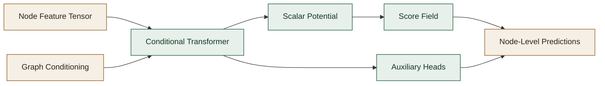

# Conditional Node Field Generator

This document explains the `ConditionalNodeFieldGenerator` implemented in this repository, what equations it uses during training and sampling, and how the surrounding graph-generation pipeline fits together.

The implementation lives primarily in
[`../conditional_node_field_graph_generator/conditional_node_field_generator.py`](../conditional_node_field_graph_generator/conditional_node_field_generator.py).

## Documentation Map

This document is the main conceptual reference for the Conditional Node Field model itself: the energy-based interpretation, how conditioning enters, how the backbone is organized, and how the generator behaves structurally. The detailed training-loss discussion now lives in [`2B_CONDITIONAL_NODE_FIELD_TRAINING_README.md`](2B_CONDITIONAL_NODE_FIELD_TRAINING_README.md), and the optimization, hyperparameter, and metrics discussion now lives in [`2C_CONDITIONAL_NODE_FIELD_OPTIMIZATION_README.md`](2C_CONDITIONAL_NODE_FIELD_OPTIMIZATION_README.md). The dedicated target-guidance discussion lives in [`2D_TARGET_GUIDANCE_README.md`](2D_TARGET_GUIDANCE_README.md).

The rest of the documentation is organized around the other layers of the stack:

[`2B_CONDITIONAL_NODE_FIELD_TRAINING_README.md`](2B_CONDITIONAL_NODE_FIELD_TRAINING_README.md)

This companion document covers the training-loss side of the model: auxiliary losses, the full training objective, sampling updates, inference-time projection, and masking behavior.

[`2C_CONDITIONAL_NODE_FIELD_OPTIMIZATION_README.md`](2C_CONDITIONAL_NODE_FIELD_OPTIMIZATION_README.md)

This companion document covers optimization-facing practice: hyperparameters, lambda interpretation, training metrics, and verbose epoch-summary semantics.

[`2D_TARGET_GUIDANCE_README.md`](2D_TARGET_GUIDANCE_README.md)

This document is the dedicated reference for the two supported target-guidance routes: classifier-free guidance (CFG) and separate post-hoc guidance through an auxiliary classifier or regressor.

[`4_MAIN_CLASS_INTERFACES_README.md`](4_MAIN_CLASS_INTERFACES_README.md)

This is the API reference. It collects the main public classes in one place, shows their primary constructors and workflow methods, explains the meaning of each important parameter, and summarizes the practical effect of increasing or decreasing those parameters. Use it when you want a user-facing interface guide rather than the modeling details.

[`1_CONDITIONAL_NODE_FIELD_GRAPH_GENERATOR_README.md`](1_CONDITIONAL_NODE_FIELD_GRAPH_GENERATOR_README.md)

This document explains the end-to-end orchestration layer built around the node generator. It focuses on how raw graphs are vectorized, how supervision batches are assembled, how the node generator and decoder are coordinated, how graph-level sampling works, and how feasibility filtering and guidance are exposed at the graph-generation level.

[`3_CONDITIONAL_NODE_FIELD_GRAPH_DECODER_README.md`](3_CONDITIONAL_NODE_FIELD_GRAPH_DECODER_README.md)

This document explains the reconstruction stage that turns node-level predictions into final `networkx` graphs. It focuses on the decoder inputs and outputs, the role of edge-probability matrices, how degree and connectivity constraints are enforced, and how the ILP-based adjacency projection behaves.

## Overview

The maintained node generator in this repository is:

- `ConditionalNodeFieldGenerator`
  A stationary, energy-based conditional generator for graph-conditioned node synthesis.

The Conditional Node Field model replaces diffusion time-conditioning and reverse-time denoising with:

- a scalar conditional energy or potential,
- a score field obtained as the gradient of that scalar,
- a stationary score-matching objective,
- iterative relaxation or Langevin-style sampling in feature space.

In this repository, the Conditional Node Field generator is used as the `conditioning -> node-level predictions` stage inside the broader decompositional pipeline:

1. encode each training graph into node feature matrices and graph-level conditioning vectors,
2. train the Conditional Node Field generator to map graph-level conditions to node-level structural and semantic predictions,
3. use the model heads and graph decoder to map generated node-level predictions back into graphs.



## High-Level Idea

Diffusion models learn a time-dependent denoising field:

$$
\epsilon_\theta(x_t, c, t)
$$

or equivalently a time-dependent score field.

The Conditional Node Field model implemented here learns a stationary conditional score field:

$$
g_\theta(x, c)
$$

where:

- $x$ is a padded node-feature tensor for one graph,
- $c$ is the graph-level conditioning input,
- $g_\theta$ is constrained to be integrable because it comes from a scalar potential.

Instead of directly outputting a vector field, this implementation defines a scalar conditional potential:

$$
\phi_\theta(x, c)
$$

and obtains the score field by differentiation:

$$
g_\theta(x, c) = - \nabla_x \phi_\theta(x, c)
$$

This means the learned field is conservative by construction.

## Energy-Based View

The conceptual target is a conditional energy-based model:

$$
p_\theta(x \mid c) \propto \exp(-E_\theta(x, c))
$$

with:

$$
E_\theta(x, c) \equiv \phi_\theta(x, c)
$$

Then:

$$
\nabla_x \log p_\theta(x \mid c) = -\nabla_x E_\theta(x, c)
$$

and because this code uses $E_\theta = \phi_\theta$, the implemented score field is:

$$
g_\theta(x, c) = -\nabla_x \phi_\theta(x, c)
$$

This is the field that drives both training and generation.

## What the Model Predicts

The Conditional Node Field module does not directly output node features. It outputs:

1. a scalar conditional potential through `potential_head`,
2. a score field through autograd,
3. auxiliary head predictions for:
   - node existence,
   - node degree,
   - optional locality supervision.

So the primary generative object is the score:

$$
g_\theta(x, c)
$$

not a reconstruction vector and not a diffusion residual.

Node existence should be interpreted as a learned occupancy process over node slots. In this repository, the global node count is conditioned explicitly, but the model still learns which specific slots should materialize. That allows generation to stay gradual: several candidate node slots can remain plausible early in sampling and only later coalesce into a committed support set.

## Inputs and Outputs

### Inputs

For a batch of graphs, the Conditional Node Field module consumes:

- `input_examples`
  Shape $(B, N, D)$, padded node features.
- `global_condition`
  Shape $(B, C)$ or $(B, M, C)$, graph-level conditioning vectors or tokens.
- explicit graph-size channels inside the conditioning input, including node count and edge count.
- `node_mask`
  Shape $(B, N)$, boolean mask indicating valid node slots.

The important distinction is:

- the conditioned node count is a global cardinality target,
- `node_mask` is the per-slot realization of that target.

Those are not equivalent. A scalar count does not identify which latent node positions are active, and the Conditional Node Field dynamics are free to explore alternative support sets before settling on a final one.

At training time, if node-label supervision is enabled, the model receives explicit
per-node categorical targets rather than a graph-level label-composition summary.

### Outputs

At inference time, the wrapper returns:

- a list of generated node-feature matrices in original feature scale,
- optionally with degree channel overwritten by the auxiliary degree head,
- and node existence channel snapped using the existence head.

Additionally, if node-label supervision is enabled, the wrapper stores the per-node
predicted categorical labels from the final latent state in:

```python
conditional_node_field_generator.last_predicted_node_label_classes_
```

These labels are not written directly into the node-feature tensor because node labels
are categorical metadata, not continuous feature channels in the Conditional Node Field state.

## Conditioning Interface

The maintained node generator supports two conditioning layouts:

- a single graph-level conditioning vector with shape `(B, C)`
- a sequence of conditioning tokens with shape `(B, M, C)`

Those two forms are handled by the same backbone.

If the condition arrives as a single vector, the implementation treats it as one condition token.
If it arrives as a sequence, the full token sequence is preserved and exposed to cross-attention.

So conceptually:

- `(B, C)` means one global condition token per graph
- `(B, M, C)` means a small condition memory made of `M` tokens per graph

This matters because the node generator is not restricted to conditioning on a single pooled graph
embedding. It can also condition on a richer tokenized representation in which different condition
tokens can carry different pieces of graph-level context.

### Use Cases For Vector Conditioning

One important workflow is to use a graph encoder that produces one embedding for the whole graph.

In that case, the conditioning input behaves like a direct latent representation of the graph itself.
That is useful because the graph generator can then map operations performed in that conditioning
space back into reconstructed graph space.

Practically, this supports workflows such as:

- interpolation between two graph embeddings and decoding the intermediate graphs
- similarity-driven retrieval or sampling near a reference graph embedding
- means, barycentres, or other averages in conditioning space followed by graph reconstruction
- other vector operations in the conditioning space, followed by node-field generation and graph decoding

This is the simplest and most direct interpretation of the conditioning path:

- one graph
- one embedding
- one conditioning vector
- one reconstructed graph sampled from that conditioning state

That is why the graph-level generator exposes operations such as interpolation, conditioning-space
sampling, and centroid-style decoding.

### Use Cases For Tokenized Conditioning

Conditioning on a set of embeddings is more flexible.

Instead of describing the whole graph with one pooled vector, the condition can describe the graph
through multiple tokens, each carrying part of the higher-level structure. The node generator can then
attend selectively to those tokens during generation.

One use case is sequential or causal graph modeling:

- take one graph
- derive a set of node embeddings or other token embeddings from it
- use those embeddings as the condition memory for generating the next graph

In that setup, the model does not just condition on a compressed global summary. It conditions on a
structured memory extracted from the previous graph, which is a better fit for temporal, causal, or
state-transition relationships between graphs.

Another use case is conditioning on an abstract graph representation rather than on the final graph
directly.

For example:

- an abstract graph could contain nodes representing motifs such as cycles, chains, or trees
- edges in that abstract graph could represent high-level attachment structure
- the conditioning tokens would then encode that abstract graph
- the generated graph would be a concrete realization consistent with that higher-level scaffold

For molecular graphs, this can be interpreted as conditioning on a coarse structural plan. A large
molecule might first be abstracted into a small graph whose nodes stand for motifs such as cycles and
trees. Generation can then be conditioned on that abstract motif graph, so the model reconstructs a
full molecular graph from a high-level structural representation rather than from a single pooled vector.

So the two conditioning styles emphasize different use cases:

- vector conditioning is best when the graph should be manipulated as one latent point in a graph-level space
- tokenized conditioning is best when the condition should preserve internal structure, memory, temporal context, or abstraction structure

Operationally, the backbone does this:

1. project node features into latent node tokens
2. project condition vectors or condition tokens into the same latent space
3. use the projected condition tokens as cross-attention memory for the node tokens

So the node tokens attend to the conditioning representation, rather than just concatenating one
global vector to every node row.

In the implementation, this behavior is explicit in
[`../conditional_node_field_graph_generator/conditional_node_field_generator.py`](../conditional_node_field_graph_generator/conditional_node_field_generator.py):

- if `global_condition_vector` has shape `(B, C)`, it is unsqueezed to `(B, 1, C)`
- if it already has shape `(B, M, C)`, it is kept as-is
- the resulting condition tokens are projected and passed as `k` and `v` to the cross-attention layers

There is also one optional simplification:

- `pool_condition_tokens=False`
  keep the full token sequence and let the node tokens attend to all condition tokens
- `pool_condition_tokens=True`
  mean-pool the condition tokens into a single token before cross-attention

That switch is useful when the conditioning representation is naturally tokenized but a simpler,
more compressed conditioning path is preferred.

## Data Preprocessing

The wrapper preserves the established preprocessing behavior:

- node-feature tensors are padded to a common maximum node count,
- node features are scaled with `MinMaxScaler`,
- conditional features are scaled separately,
- degree scaling statistics are stored so discrete degree labels can be recovered,
- padded positions are masked during Conditional Node Field training and attention.

This matters because the Conditional Node Field model operates in scaled feature space, while the downstream decoder expects outputs back in the original feature space.

It also matters generatively: padding is not just a batching convenience. It provides a larger latent support over which the model can express tentative node occupancy decisions before the existence process sharpens into a final graph.

## Model Architecture

The Conditional Node Field generator uses a conditional transformer backbone:

1. node features are layer-normalized,
2. node features are projected into a latent dimension,
3. graph-level conditions are projected into the same latent space,
4. node tokens attend to condition tokens through stacked cross-transformer layers,
5. latent node tokens are converted into a scalar potential and auxiliary predictions.

### Backbone

Let:

- $x \in \mathbb{R}^{B \times N \times D}$ be node features,
- $c \in \mathbb{R}^{B \times M \times C}$ be condition tokens,
- $h \in \mathbb{R}^{B \times N \times H}$ be latent node tokens.

The encoder computes:

$$
h = f_\theta(x, c)
$$

using learned linear projections and repeated cross-attention blocks.

### Potential

Each latent node token contributes a scalar:

$$
\phi_i = \mathrm{MLP}(h_i)
$$

and the graph-level scalar potential is the masked sum:

$$
\phi_\theta(x, c) = \sum_{i=1}^{N} m_i \, \phi_i
$$

where $m_i \in \{0, 1\}$ is the node mask.

### Score

The score is computed by differentiating the scalar potential with respect to the input node features:

$$
g_\theta(x, c) = -\nabla_x \phi_\theta(x, c)
$$

This is done with PyTorch autograd in the implementation.

## Core Conditional Node Field Training Objective

The basic training construction is Gaussian corruption of clean data.

Given clean node features:

$$
x
$$

sample Gaussian noise:

$$
\varepsilon \sim \mathcal{N}(0, I)
$$

and define noisy inputs:

$$
\tilde{x} = x + \sigma \varepsilon
$$

### Target Score

Using denoising score-matching logic, the target field for Gaussian corruption is:

$$
g^*(\tilde{x}) = - \frac{\varepsilon}{\sigma}
$$

This is also the implementation target score.

### Conditional Node Field Loss Used Here

The implementation minimizes masked mean squared error between learned score and target score.
The important implementation detail is that it averages per active node-feature, not just per active node:

$$\mathcal{L}_{\mathrm{node\_field}} = \mathbb{E}_{x,\varepsilon}\left[\left\|g_\theta(\tilde{x}, c) + \frac{\varepsilon}{\sigma}\right\|^2\right]$$

with masking applied to padded node positions.

Expanded with mask $m$ and feature dimension $D$:

$$\mathcal{L}_{\mathrm{node\_field}} = \frac{\sum_{b,i,d} m_{b,i}\left(g_\theta(\tilde{x}, c)_{b,i,d} + \frac{\varepsilon_{b,i,d}}{\sigma}\right)^2}{D \sum_{b,i} m_{b,i}}$$

So this is a per-active-node, per-feature score-matching loss. That keeps its scale much more stable when the node embedding dimensionality changes.

## Denoised Estimate

After learning the score on noisy inputs, the implementation forms a denoised estimate:

$$
\hat{x} = \tilde{x} + \sigma^2 g_\theta(\tilde{x}, c)
$$

This is a feature-wise version of the usual denoising correction.

That estimate is then reused for auxiliary supervised heads.

## Companion Operational Reference

The full operational discussion now lives across [`2B_CONDITIONAL_NODE_FIELD_TRAINING_README.md`](2B_CONDITIONAL_NODE_FIELD_TRAINING_README.md) and [`2C_CONDITIONAL_NODE_FIELD_OPTIMIZATION_README.md`](2C_CONDITIONAL_NODE_FIELD_OPTIMIZATION_README.md), including:

- auxiliary and structural losses,
- the total training objective,
- sampling updates and Langevin noise,
- inference-time projection,
- node-label supervision behavior,
- padding and masking behavior,
- main hyperparameters,
- training metrics and epoch-summary interpretation.

## Typical Training Flow

At a conceptual level, one training step is:

1. start from padded, scaled node features $x$,
2. sample Gaussian noise $\varepsilon$,
3. build noisy features $\tilde{x} = x + s \odot \varepsilon$,
4. encode $(\tilde{x}, c)$ into latent tokens,
5. compute scalar potential $\phi_\theta(\tilde{x}, c)$,
6. differentiate to get score $g_\theta(\tilde{x}, c)$,
7. minimize score-matching loss against $-\varepsilon / s$,
8. form denoised estimate $\hat{x}$,
9. compute degree and existence losses on $\hat{x}$,
10. add optional locality supervision.

## Typical Sampling Flow

1. sample initial node features from Gaussian noise,
2. repeatedly compute the conditional score field,
3. update the sample in the score direction,
4. optionally add Langevin noise,
5. run a final structural projection using existence and degree heads,
6. inverse-transform back to original feature scale.

## Practical Notes

### 1. The model still depends on good preprocessing

The Conditional Node Field model is sensitive to scaling because it operates directly in feature space and uses gradients with respect to inputs.

### 2. Sampling hyperparameters matter a lot

If generations are poor, `sampling_step_size`, `sampling_steps`, and `node_field_sigma` are the first places to look.

### 3. The auxiliary heads matter

Without the existence and degree heads, the Conditional Node Field alone may produce softer outputs that are harder for the downstream decoder to interpret structurally.

### 4. Guidance uses two separate APIs

The maintained implementation supports both:

- classifier-free guidance over explicit target-conditioning channels,
- separate post-hoc guidance through an auxiliary classifier or regressor.

Those routes use different public methods so the conditioning semantics stay explicit.

## Source Notes

Related background includes:

- Wang and Du, *Equilibrium Matching: Generative Modeling with Implicit Energy-Based Models*

The denoising score-matching identity behind the Gaussian corruption target is closely related to:

- Vincent, *A Connection Between Score Matching and Denoising Autoencoders*

This repository adapts those ideas into a conditional node-feature generator for graph generation.

## Glossary

### Auxiliary head

A supervised prediction layer attached to the latent representation, used here for node existence, degree, and locality.

### Condition or conditioning vector

Graph-level information supplied to the Conditional Node Field generator so it can produce node features for a desired graph context.

### Conservative field

A vector field that can be written as the gradient of a scalar potential.

### Degree channel

The feature dimension designated to represent node degree. In this repo the default index is `1`.

### Energy

A scalar function $E(x, c)$ whose negative gradient defines the score or force field driving samples toward higher probability regions.

### Conditional Node Field Lineage

This implementation sits in the broader family of stationary, energy-based score-learning approaches used instead of diffusion.

### Existence channel

The feature dimension used to indicate whether a node slot is active. In this repo the default signal is feature channel `0`.

### Graph-level condition token

A projected conditioning vector used by the transformer backbone as cross-attention memory.

### Integrable field

A vector field that is the gradient of some scalar function. Here this is enforced by differentiating a scalar potential.

### Langevin noise

Gaussian noise injected during sampling updates to encourage exploration and approximate stochastic sampling rather than purely deterministic relaxation.

### Locality supervision

Optional training labels on node pairs indicating whether they should be considered locally connected or related.

### Mask

A boolean tensor indicating which node positions are real and which are padding.

### Potential

The scalar function $\phi_\theta(x, c)$ implemented by the Conditional Node Field module. In this code it acts as the conditional energy.

### Score

The gradient of log-density with respect to input features. In this implementation:

$$
g_\theta(x, c) = -\nabla_x \phi_\theta(x, c)
$$

### Stationary field

A field without an explicit diffusion-time variable. The same field is used throughout training and sampling.

### Transformer backbone

The stack of attention blocks that combines node features with graph-level conditioning information before potential and auxiliary heads are applied.
